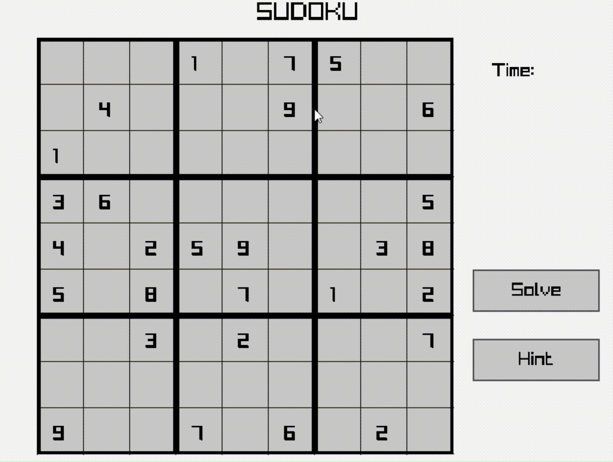

# Sudoku
An modern and interactive Sudoku game developed with [Raylib](https://www.raylib.com/). This project combines logic driven puzzle mechanics with a light graphics library to provide a modern, playable experience.

<br>

## ✨ Features  
- The 9x9 Sudoku grid is fully playable and features cell selection
- Support for keyboard and mouse input
- Invalid entries are immediately highlighted by real-time validation
- Simple UI powered by Raylib 
- A built-in timer to track completion time 
- Support for resets and new games

<br>

## ▶️ Animation


<br>

## ⚙️ Build & Run
```bash
# Clone the repo  
git clone https://github.com/Mayank-0-0/Sudoku-with-Raylib.git  
cd Sudoku-with-Raylib  

# Compile 
gcc main.c gui.c lib/sudoku_generator.c lib/gamelogic.c -lraylib -lm -o sudoku  

# Run the game  
./sudoku  
```

<br>

## 🔐 License
This project is licensed under the Unlicense License. See the [LICENSE](LICENSE) file for more details.